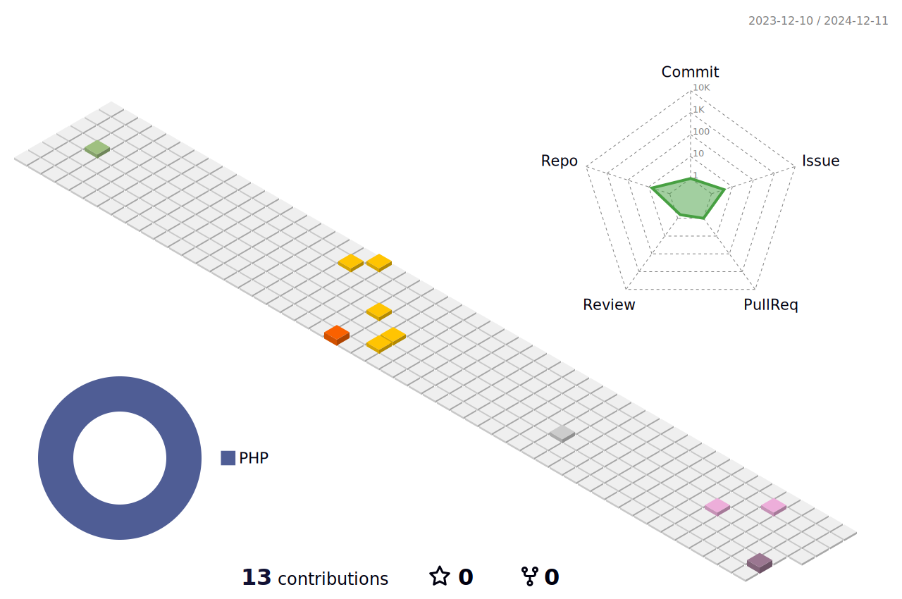

### Hello 👋

Shanghai, China・🕹Web developer

- 10年以上 Web 开发经验，熟练掌握PHP/JS/Java/Golang语言；
- 熟练掌握 Laravel、Yii2 和 ThinkPHP 等 Web 开发框架；
- 熟悉 MySQL 数据库应用开发，认识索引应用和查询优化；
- 了解 MySQL 的数据库配置管理、性能优化等基本操作技能；
- 熟悉 Redis 等 NoSQL 数据库，了解底层数据结构；
- 熟悉 Linux 系统下 LNMP 的部署、运维、配置等基本操作；
- 热衷分析和解决问题，对待工作积极负责，能够承担压力；
- 有过高并发，高访问量系统开发经验；
- 自研基于 Workerman 的 Web 框架：https://github.com/colaphp/colaphp；

https://wanganlin.com

如果你喜欢我的项目并想支持我，[点击这里 :heart:](https://github.com/sponsors/wanganlin)

