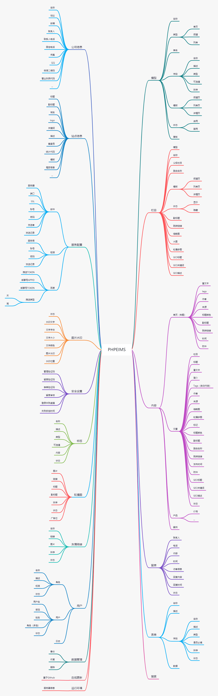

## 概览



## 实体设计

```
# 用户 User
# 角色 AuthGroup 用户组
# 菜单 AuthRule 规则表
# 授权 AuthGroupAccess
# 配置 Setting
- 基本参数 （多语言，主题）
- 公司信息
- 网站信息
# 模型 Type
# 内容 Content 栏目|内容
# 评论 Comment
# 导航 Nav
# 广告 Ad
# 友情链接 Link
# 表单 Form
# 自定义标签 Fragment
# 统计 Stat
# 日志 Log
```
