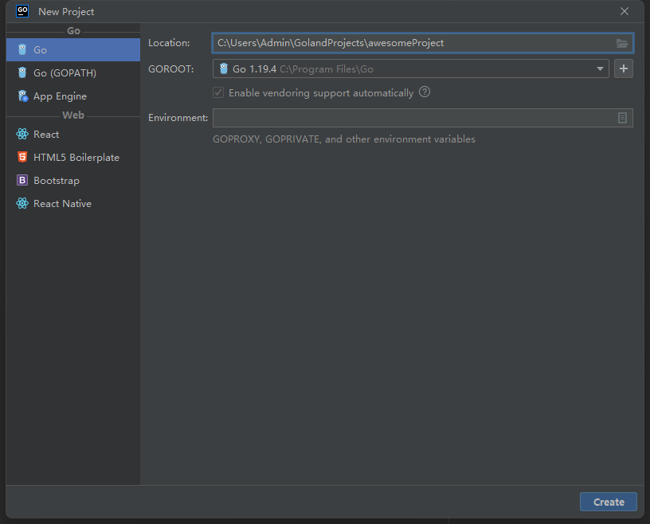
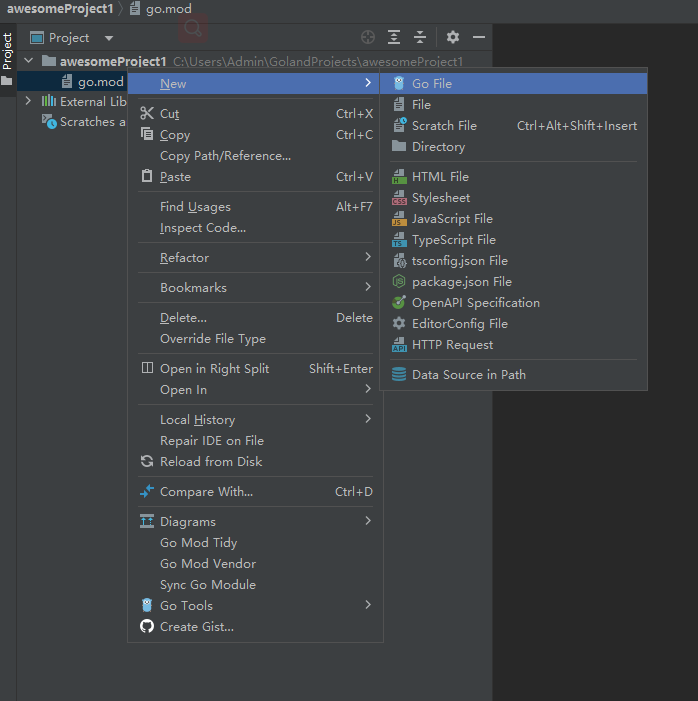
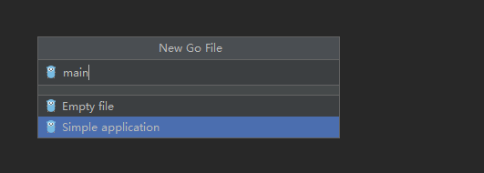
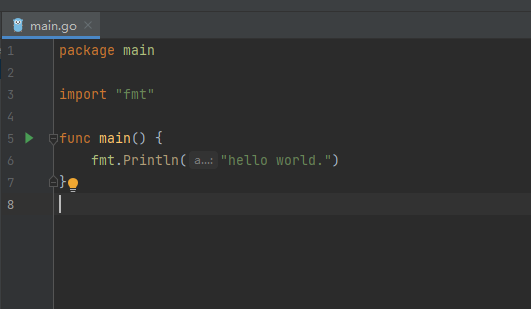
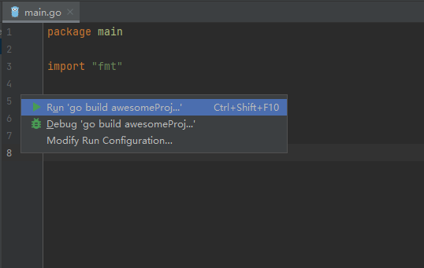
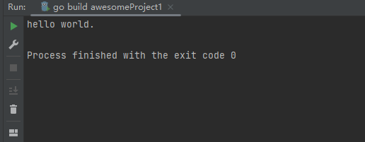

# 快速开始

## 通过 GoLand

- 点击菜单栏 `File - New - Project`，左侧菜单选择 `Go` 项目，点击 `Create`。



- 新建入口文件



- 选择 `Simple application` 类型



- 编写代码



- 启动入口



- 显示结果



## 通过 Cli

- 创建目录

```
mkdir awesomeProject
```

- 进入目录
```
cd awesomeProject
```

- 初始化

```
go mod init awesomeProject
```

- 创建文件

```
touch main.go
```

- 编辑代码

```
package main

import "fmt"

func main() {
	fmt.Println("hello world.")
}
```

- 运行代码

```
go run main.go
```